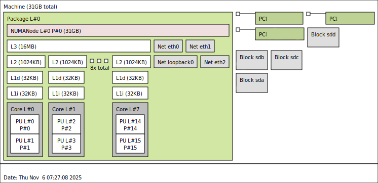

# Flock of Birds

# bird:1.6.8

```bash
# build
docker build -t bird:1.6.8 -f containers/bird-1.6.8/Dockerfile containers/bird-1.6.8
# run
docker run -it --cap-add=cap_sys_admin --cap-add=cap_net_admin --cap-add=cap_net_raw --cap-add=CAP_SETPCAP --cap-add=CAP_NET_BROADCAST --cap-add=CAP_NET_BIND_SERVICE --rm --tmpfs /run --tmpfs /tmp --tmpfs /run/lock bird:1.6.8
```

# bird:2.17.2

```bash
# build
docker build -t bird:2.17.2 -f containers/bird-2.17.2/Dockerfile containers/bird-2.17.2
# run
docker run -it --cap-add=cap_sys_admin --cap-add=cap_net_admin --cap-add=cap_net_raw --cap-add=CAP_SETPCAP --cap-add=CAP_NET_BROADCAST --cap-add=CAP_NET_BIND_SERVICE --rm --tmpfs /run --tmpfs /tmp --tmpfs /run/lock bird:2.17.2
```

# bird:3.1.4

```bash
# build
docker build -t bird:3.1.4 -f containers/bird-3.1.4/Dockerfile containers/bird-3.1.4
# run
docker run -it --cap-add=cap_sys_admin --cap-add=cap_net_admin --cap-add=cap_net_raw --cap-add=CAP_SETPCAP --cap-add=CAP_NET_BROADCAST --cap-add=CAP_NET_BIND_SERVICE --rm --tmpfs /run --tmpfs /tmp --tmpfs /run/lock bird:3.1.4
```

# frr:10.4.1

```bash
# build
docker build -t frr:10.4.1 -f containers/frr-10.4.1/Dockerfile containers/frr-10.4.1
# run
docker run -it --cap-add=cap_sys_admin --cap-add=cap_net_admin --cap-add=cap_net_raw --cap-add=CAP_SETPCAP --cap-add=CAP_NET_BROADCAST --cap-add=CAP_NET_BIND_SERVICE --rm --tmpfs /run --tmpfs /tmp --tmpfs /run/lock frr:10.4.1
```

# bngblaster:0.9.27

```bash
# build
docker build -t bngblaster:0.9.27 -f containers/bngblaster-0.9.27/Dockerfile containers/bngblaster-0.9.27
# run
docker run -it --cap-add=cap_sys_admin --cap-add=cap_net_admin --cap-add=cap_net_raw --cap-add=CAP_SETPCAP --cap-add=CAP_NET_BROADCAST --cap-add=CAP_NET_BIND_SERVICE --rm --tmpfs /run --tmpfs /tmp --tmpfs /run/lock bngblaster:0.9.27
```

# gobgp:3.36.0

```bash
# build
docker build -t gobgp:3.36.0 -f containers/gobgp-3.36.0/Dockerfile containers/gobgp-3.36.0
# run
docker run -it --cap-add=cap_sys_admin --cap-add=cap_net_admin --cap-add=cap_net_raw --cap-add=CAP_SETPCAP --cap-add=CAP_NET_BROADCAST --cap-add=CAP_NET_BIND_SERVICE --rm --tmpfs /run --tmpfs /tmp --tmpfs /run/lock gobgp:3.36.0
```

# Lab Info

## CPU lstopo


## Prefixes

### RFC 5737 IPv4

* Loopbacks: 198.51.100.0/24
* Neighbor: 192.0.2.0/24
* Benchmark Prefix: 198.18.0.0/15

### RFC 3849 IPv6

* 2001:DB8::/32
  * Loopback: 2001:DB8::/64
  * Neighbor: 2001:DB8:100::/64
  * Prefix: 2001:db8:ffff::/48


### RFC 6996 private 32bit ASNs
ref: https://www.iana.org/assignments/iana-as-numbers-special-registry/iana-as-numbers-special-registry.xhtml

* private ASN numbers 32bit
  * min: 4200000000
  * max: 4294967294

## Lab deployment for config testing

```yaml
## Ensure inside the topo that nodes CPU and RAM reservations are commented
topology:
  nodes:
  # ...
    node-name:
      kind: linux
      image: <image>
      #shm-size: 8gib
      #cpu-set: 10-15
```
```console
> containerlab deploy --reconfigure
09:58:32 INFO Containerlab started version=0.71.1
09:58:32 INFO Parsing & checking topology file=containerlab.clab.yaml
09:58:32 INFO Creating docker network name=clab IPv4 subnet=172.20.20.0/24 IPv6 subnet=3fff:172:20:20::/64 MTU=0
09:58:33 INFO Creating lab directory path=/home/a108073420/git/github/flock-of-birds/clab-flock-of-birds
09:58:33 INFO Creating container name=bird-2.17.2
09:58:33 INFO Creating container name=bird-1.6.8
09:58:33 INFO Creating container name=bird-3.1.4
09:58:33 INFO Creating container name=bngblaster-0.9.27
09:58:36 INFO Created link: bird-1.6.8:uplink ▪┄┄▪ bngblaster-0.9.27:bird-1.6.8
09:58:36 INFO Created link: bird-2.17.2:uplink ▪┄┄▪ bngblaster-0.9.27:bird-2.17.2
09:58:37 INFO Created link: bird-3.1.4:uplink ▪┄┄▪ bngblaster-0.9.27:bird-3.1.4
09:58:38 INFO Created link: bird-1.6.8:uplink-rx1 ▪┄┄▪ bngblaster-0.9.27:bird-1.6.8-rx1
09:58:38 INFO Created link: bird-2.17.2:uplink-rx1 ▪┄┄▪ bngblaster-0.9.27:bird-2.17.2-rx1
09:58:38 INFO Created link: bird-3.1.4:uplink-rx1 ▪┄┄▪ bngblaster-0.9.27:bird-3.1.4-rx1
09:58:39 INFO Created link: bird-1.6.8:uplink-rx2 ▪┄┄▪ bngblaster-0.9.27:bird-1.6.8-rx2
09:58:39 INFO Created link: bird-2.17.2:uplink-rx2 ▪┄┄▪ bngblaster-0.9.27:bird-2.17.2-rx2
09:58:39 INFO Created link: bird-3.1.4:uplink-rx2 ▪┄┄▪ bngblaster-0.9.27:bird-3.1.4-rx2
09:58:39 INFO Adding host entries path=/etc/hosts
09:58:39 INFO Adding SSH config for nodes path=/etc/ssh/ssh_config.d/clab-flock-of-birds.conf
Failed fetching latest version information
╭───────────────────────────────────────┬─────────────────────────────────────┬─────────┬───────────────────╮
│                  Name                 │              Kind/Image             │  State  │   IPv4/6 Address  │
├───────────────────────────────────────┼─────────────────────────────────────┼─────────┼───────────────────┤
│ clab-flock-of-birds-bird-1.6.8        │ linux                               │ running │ 172.20.20.5       │
│                                       │ docker.io/library/bird:1.6.8        │         │ 3fff:172:20:20::5 │
├───────────────────────────────────────┼─────────────────────────────────────┼─────────┼───────────────────┤
│ clab-flock-of-birds-bird-2.17.2       │ linux                               │ running │ 172.20.20.3       │
│                                       │ docker.io/library/bird:2.17.2       │         │ 3fff:172:20:20::3 │
├───────────────────────────────────────┼─────────────────────────────────────┼─────────┼───────────────────┤
│ clab-flock-of-birds-bird-3.1.4        │ linux                               │ running │ 172.20.20.2       │
│                                       │ docker.io/library/bird:3.1.4        │         │ 3fff:172:20:20::2 │
├───────────────────────────────────────┼─────────────────────────────────────┼─────────┼───────────────────┤
│ clab-flock-of-birds-bngblaster-0.9.27 │ linux                               │ running │ 172.20.20.4       │
│                                       │ docker.io/library/bngblaster:0.9.27 │         │ 3fff:172:20:20::4 │
╰───────────────────────────────────────┴─────────────────────────────────────┴─────────┴───────────────────╯
```


## Lab deployment for performance testing

```yaml
## Ensure inside the topo that nodes CPU and RAM reservations are commented
topology:
  nodes:
  # ...
    node-name:
      kind: linux
      image: <image>
      shm-size: 8gib
      cpu-set: 2-9
```

* Only deploy the part of the LAB you want to do a performance test on.
* My setup has only 8 cores.
* So I dedicate 3 + 3HT to the Routing Daemon and 4 + 4HT for the BNGBlaster.
* The first 1 + 1HT is dedicated to the linux kernel of my system.

```console
# example for bngblaster + bird 1.6.8 
> containerlab deploy --node-filter bird-1.6.8,bngblaster-0.9.27
07:32:43 INFO Containerlab started version=0.71.1
07:32:43 INFO Applying node filter: ["bird-1.6.8" "bngblaster-0.9.27"]
07:32:43 INFO Parsing & checking topology file=containerlab.clab.yaml
07:32:43 INFO Creating docker network name=clab IPv4 subnet=172.20.20.0/24 IPv6 subnet=3fff:172:20:20::/64 MTU=0
07:32:44 INFO Creating lab directory path=/home/a108073420/git/github/flock-of-birds/clab-flock-of-birds
07:32:44 INFO Creating container name=bngblaster-0.9.27
07:32:44 INFO Creating container name=bird-1.6.8
07:32:46 INFO Created link: bird-1.6.8:uplink ▪┄┄▪ bngblaster-0.9.27:bird-1.6.8
07:32:46 INFO Adding host entries path=/etc/hosts
07:32:46 INFO Adding SSH config for nodes path=/etc/ssh/ssh_config.d/clab-flock-of-birds.conf
You are on the latest version (0.71.1)
╭───────────────────────────────────────┬─────────────────────────────────────┬─────────┬───────────────────╮
│                  Name                 │              Kind/Image             │  State  │   IPv4/6 Address  │
├───────────────────────────────────────┼─────────────────────────────────────┼─────────┼───────────────────┤
│ clab-flock-of-birds-bird-1.6.8        │ linux                               │ running │ 172.20.20.3       │
│                                       │ docker.io/library/bird:1.6.8        │         │ 3fff:172:20:20::3 │
├───────────────────────────────────────┼─────────────────────────────────────┼─────────┼───────────────────┤
│ clab-flock-of-birds-bngblaster-0.9.27 │ linux                               │ running │ 172.20.20.2       │
│                                       │ docker.io/library/bngblaster:0.9.27 │         │ 3fff:172:20:20::2 │
╰───────────────────────────────────────┴─────────────────────────────────────┴─────────┴───────────────────╯
```

## The most important test using RTBricks BNGBlaster
ref: https://rtbrick.github.io/bngblaster/controller.html
ref: https://github.com/rtbrick/BGP-CP-DP-Testing

